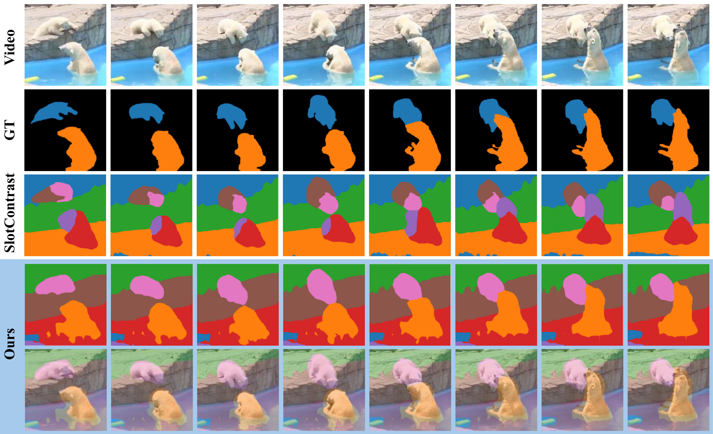
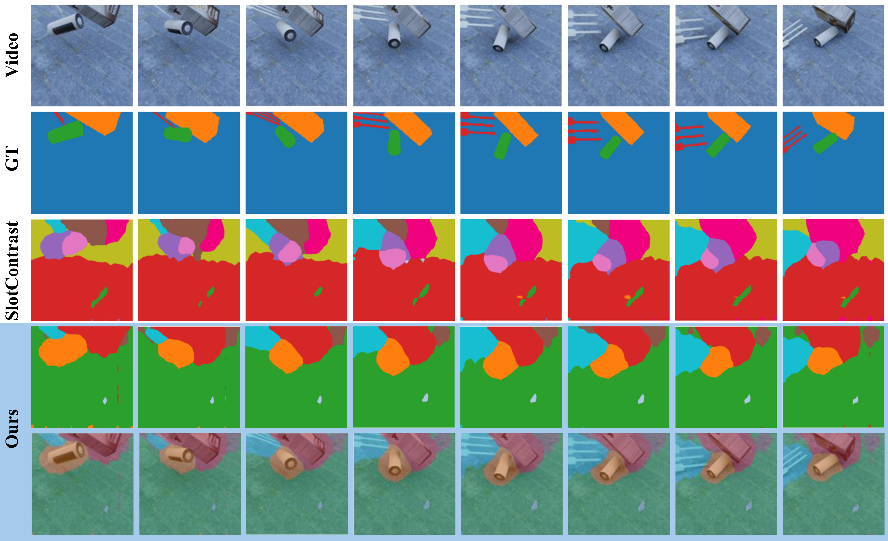

<div align="center">

# SlotCurri

### Reconstruction-Guided Slot Curriculum: <br> Addressing Object Over-Fragmentation in Video Object-Centric Learning


**CVPR 2026**

[WonJun Moon](https://wjun0830.github.io/), [Hyun Seok Seong](https://hynnsk.github.io/), [Jae-Pil Heo](https://sites.google.com/site/jaepilheo)

Sungkyunkwan University

[](https://arxiv.org/abs/2603.22758)
[](.)

</div>

---

## Abstract

Video Object‑Centric Learning seeks to decompose raw videos into a small set of object slots, but existing slot‑attention models often suffer from severe over‑fragmentation. This is because the model is implicitly encouraged to occupy all slots to minimize the reconstruction objective, thereby representing a single object with multiple redundant slots. We tackle this limitation with a reconstruction‑guided slot curriculum (SlotCurri). Training starts with only a few coarse slots and progressively allocates new slots where reconstruction error remains high, thus expanding capacity only where it is needed and preventing fragmentation from the outset. Yet, during slot expansion, meaningful sub‑parts can emerge only if coarse‑level semantics are already well separated; however, with a small initial slot budget and an MSE objective, semantic boundaries remain blurry. Therefore, we augment MSE with a structure‑aware loss that preserves local contrast and edge information to encourage each slot to sharpen its semantic boundaries. Lastly, we propose a cyclic inference that rolls slots forward and then backward through the frame sequence, producing temporally consistent object representations even in the earliest frames. All combined, SlotCurri addresses object over-fragmentation by allocating representational capacity where reconstruction fails, further enhanced by structural cues and cyclic inference. Notable FG-ARI gains of +6.8 on YouTube-VIS and +8.3 on MOVi-C validate the effectiveness of SlotCurri.


## Key Contributions

| Component | Description |
|---|---|
| **Slot Curriculum** | Progressively allocates slots where reconstruction error is high |
| **Structure-Aware Loss** | SSIM-based loss to sharpen semantic boundaries for precise slot partitioning |
| **Cyclic Inference** | Forward + backward temporal rolling for consistent slot representations |

---

## Installation

```bash
# Base install
poetry install

# Optional extras
poetry install -E tensorflow   # for MOVi dataset processing
poetry install -E coco         # for COCO / YouTube-VIS dataset processing
poetry install -E notebook     # for visualization notebooks

# Additional dependencies
poetry run pip install pytorch_msssim kornia lpips
```

## Dataset

The datasets should be placed under a common root directory with the following structure:

```
├── SlotCurri/
└── dataset/
    ├── ytvis2021_resized/    
    ├── movi_c/               
    └── movi_e/               
```

| Dataset | Download |
|---|---|
| YouTube-VIS 2021 | [Google Drive]([https://drive.google.com/file/d/1Iv-2zK6MnH0oDFTx9iBgQcPNh5PBzM7i/view?usp=sharing]) (26.43GB) |
| MOVi-C | [Google Drive]([https://drive.google.com/file/d/1CvHkK0PhqHrC8MtMtFCXBEXZbyrC6-hH/view?usp=sharing]) (7.43GB) |
| MOVi-E | [Google Drive]([https://drive.google.com/file/d/1qGXzMwEMbYRp7OH2GJlkS3lvZPv3grkt/view?usp=sharing]) (8.26GB) |

> See [Dataset Preparation](#dataset-preparation) below for download and preprocessing instructions.

---

## Training

```bash
# YouTube-VIS 2021
poetry run python -m slotcurri.train --run-eval-after-training configs/slotcurri/ytvis2021.yaml

# MOVi-E
poetry run python -m slotcurri.train --run-eval-after-training configs/slotcurri/movi_e.yaml

# MOVi-C
poetry run python -m slotcurri.train --run-eval-after-training configs/slotcurri/movi_c.yaml
```

---

## Pretrained Checkpoints

| Dataset | Download |
|---|---|
| MOVi-C | [Google Drive](https://drive.google.com/file/d/1QPSrlQigvN7kvUhQf6LV-EWJrmMOFG7j/view?usp=drive_link) |
| MOVi-E | [Google Drive](https://drive.google.com/file/d/1XHJOJCJxciE1BDUiYKLYlvma4LeDmJRg/view?usp=drive_link) |
| YouTube-VIS 2021 | [Google Drive](https://drive.google.com/file/d/1rSFU6IeDo7EsXg77SsTp9Fwn73FR9_KV/view?usp=drive_link) |

---

## Dataset Preparation

### MOVi-C / MOVi-E

```bash
poetry install -E tensorflow

# MOVi-C
python data/save_movi.py --level c --split train --maxcount 32 --only-video <root_data_dir>/movi_c
python data/save_movi.py --level c --split validation --maxcount 32 <root_data_dir>/movi_c

# MOVi-E
python data/save_movi.py --level e --split train --maxcount 32 --only-video <root_data_dir>/movi_e
python data/save_movi.py --level e --split validation --maxcount 32 <root_data_dir>/movi_e
```

### COCO

```bash
poetry install -E coco

cd data
python save_coco.py --split train --maxcount 128 --only-images --out-path <root_data_dir>/coco
python save_coco.py --split validation --maxcount 128 --out-path <root_data_dir>/coco
```

> Images are resized to 256×256 and saved as sharded `.tar` files. The script automatically downloads and extracts the raw COCO dataset to `--download-dir`.

### YouTube-VIS 2021

```bash
poetry install -E coco

cd data
python save_ytvis2021.py --split train --maxcount 32 --only-videos --resize --out-path <root_data_dir>/ytvis2021_resized
python save_ytvis2021.py  --split validation --maxcount 10 --resize --out-path <root_data_dir>/ytvis2021_resized
```

> Raw files should be downloaded to the `ytvis2021_raw` folder beforehand.


---

## Qualitative Results

### YouTube-VIS 2021



### MOVi-C



---

## Citation

```bibtex
@inproceedings{moon2026reconstruction,
  title={Reconstruction-Guided Slot Curriculum: Addressing Object Over-Fragmentation in Video Object-Centric Learning},
  author={Moon, WonJun and Seong, Hyun Seok and Heo, Jae-Pil},
  booktitle={Proceedings of the IEEE/CVF Conference on Computer Vision and Pattern Recognition (CVPR)},
  year={2026}
}
```

---

## Acknowledgement

The codebase is adapted from [Videosaur](https://github.com/martius-lab/videosaur) and [SlotContrast](https://github.com/wjun0830/SlotContrast).

---

## License

This codebase is released under the [MIT License](LICENSE).